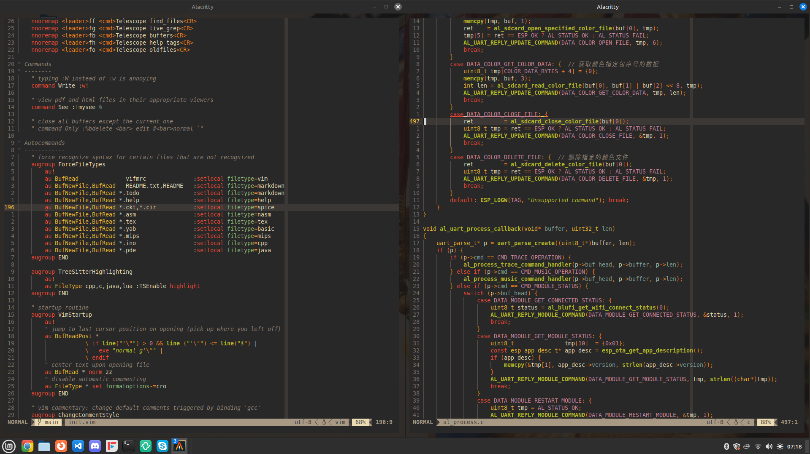

# My Neovim Configuration

1. Keep Nvim updated as much as possible (through PPA/official releases page).
1. Keep things manageable (preferably, < 500 loc).
1. Document settings as much as possible, concisely.
1. Do not make leader key something you use a lot in insert mode.
1. Avoid defaults (:help nvim-defaults or https://neovim.io/doc/user/vim_diff.html)
1. Prefer Neovim's (often improved) settings/plugins to their older Vim counterparts.



# Installing the latest version of Neovim (on Linux)

Neovim's newer versions come integrated with cool features (namely: treesitter
and LSP) that might be of interest to you as a programmer. There might also be
compatibility issues with plugins especially if they rely on the integration
features introduced in newer versions which is why they won't work on older
versions. Being on a distro like Ubuntu or Mint probably means that you are
stuck on an older version. You can update with either:

* Adding the Neovim PPA, updating your repositories and then installing from
  the command line. Note that the PPA may still not provide the very latest
  stable/nightly build. (In my case, the latest stable build at the time of
  writing was v0.8+ and the version that I pulled from the PPA was v0.7+.) An
  issue that I faced with the PPA version in try to install certain plugins was
  [this](https://github.com/shaunsingh/nord.nvim/issues/113), which I was told
  could be resolved by switching to an even newer release. For that I turned to
  the next option.

## Do not purge to avoid removing configuration files!

```
sudo apt remove -y neovim # remove previous installation (optional)
sudo add-apt-repository ppa:neovim-ppa/stable
sudo apt-get update
sudo apt-get install neovim
```

* Download the *latest* *stable build* from the 
   [Neovim releases page](https://github.com/neovim/neovim/releases). 
   For me, as of the time of writing this document, the latest stable version is 
   [NVIM v0.8.3](https://github.com/neovim/neovim/releases/tag/stable). I prefer the
   Debian package `nvim-linux64.deb`.


* Then install it from your Downloads directory.

```
sudo apt install ./nvim-linux64.deb
```

* If you already had an older version of Neovim installed, you have to remove
  it and also auto-remove dependencies that may prevent installation of the deb
  package:

```
sudo apt remove --auto-remove neovim
```

* Try running Neovim as `nvim`. Set your `$EDITOR` environment variable to
  `nvim`. Alias `vim` to `nvim` if required. Put all these changes into your
  `.bashrc`.

* Verify that the version is as expected by running:

```
:version
```

* You may encounter a problem with `Failed to load python3 host`, which for me
  was resolved by downloading a package (possibly removed during `autoremove`):

```
sudo apt install python3-neovim
```

* After a complete installation, open your config file in
  `~/config/nvim/init.vim` and update your configuration/settings.

* Run a `:checkhealth` command to see if things are in order. If optional
  providers are missing, you may want to update them. Turns out I had
  unintentionally uninstalled my clipboard program (`xclip`) which was caught
  by `:checkhealth` as in the absence of one, the clipboard functionality
  provided by Vim's + and * registers would not have worked. Reinstalling
  `xclip` fixed it immediately.
